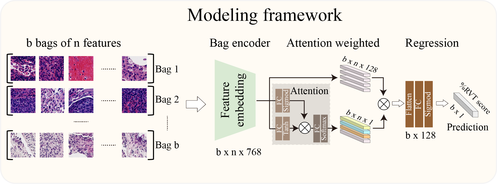
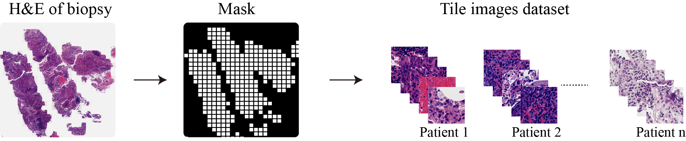
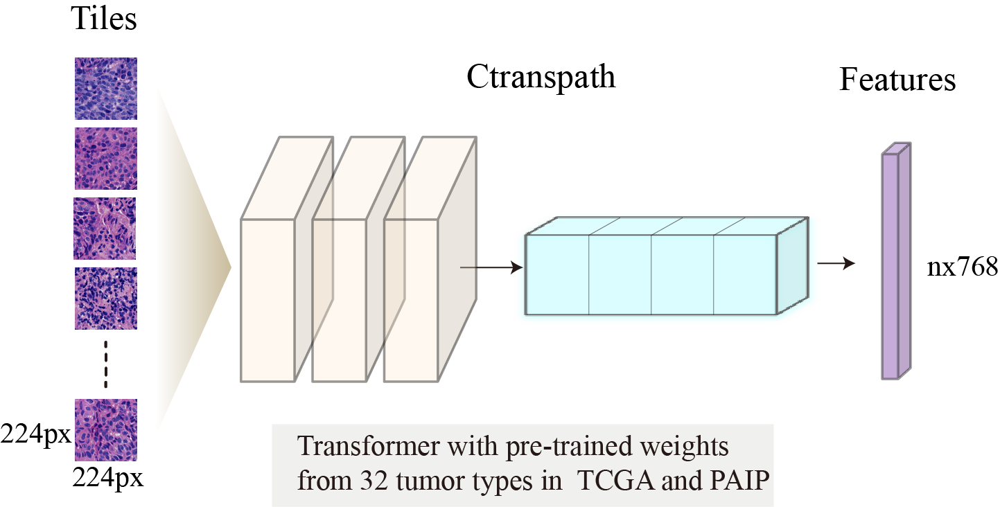

# Deep-learning pretreatment assessment of pathological response to neoadjuvant chemotherapy from needle biopsy in patients with non-small cell lung cancer
## Abstract
Neoadjuvant chemotherapy (NAC) is a widely used and crucial therapeutic strategy for patients with resectable non-small cell lung cancer (NSCLC). However, individual responses to NAC vary substantially among patients, limiting its clinical benefit. In this study, we proposed a weakly supervised deep learning model, DeepDrRVT, for the pretreatment prediction of pathological response to NAC in patients with NSCLC from biopsy specimens by integrating self-supervised feature extraction and attention-based deep multiple instance learning. The DeepDrRVT achieves robust predictability and generalizability in multi-center cohorts with AUCs of 0.954, 0.872 and 0.848 for complete pathological response (CPR), and 0.968, 0.893 and 0.831 for major pathological response (MPR). The digitally assessed percent viable tumor by DeepDrRVT correlated significantly with visual assessment by local pathologists, and was also associated with longer disease-free survival (DFS) in all cohorts. Furthermore, DeepDrRVT remained an independent prognostic factor associated with DFS after adjusting for clinicopathologic variables. Thus, DeepDrRVT holds promise as an accessible and reliable tool for clinicians to make more informed treatment decisions before initiating NAC.



## System requirements

#### Hardware Requirements

```
NVIDIA GeForce RTX 4080 GPU
```

#### OS Requirements

This package is supported for Linux and Windows. The package has been tested on the following systems:

```
Linux 3.10.0-957.el7.x86_64
Windows 11 x64
```
#### Software Prerequisites

```
Python 3.8.12
Numpy 1.20.1
Scipy 1.6.2
Pytorch 1.9.1+/CUDA 10.1
torchvision 0.10.1
Pillow 8.2.0
opencv-python 4.5.5.64
openslide-python 1.1.1
Scikit-learn 0.24.1
R version 4.3.0
```

### Installation guide

It is recommended to install the environment in the Linux 3.10.0-957.el7.x86_64 system.

* First install Anconda3.

* Then install CUDA 10.x and cudnn.

* Finall intall these dependent python software library.

The installation is estimated to take 1 hour, depending on the network environment.


## Predictive models training

#### H&E Tile Segmentation with Watershed

Convert the SVS file to PNG format and use the watershed algorithm to transform the original image into a binary image. Divide the entire H&E image into tiles of size 224x224, ensuring that each tile contains more than 40% of the tissue content.
```
python ./code/1_data processing/1.Image Segmentation.py 
```

Store tiles from different queues in an HDF5 file. HDF5 is a file format designed for storing and organizing large amounts of data, making it especially suitable for handling images, scientific data, and other large datasets. It helps reduce memory usage and speeds up model execution.
```
python ./code/1_data processing/2.H5D File.py 
```

### Usage: Pre-Training Vision Transformers for histopathology images (CTransPath)
It is recommended that you use **CTransPath** as the preferred histopathology images feature extractor
##### Usage: Preparation
Install the modified [timm](https://drive.google.com/file/d/1JV7aj9rKqGedXY1TdDfi3dP07022hcgZ/view?usp=sharing) library
```
pip install timm-0.5.4.tar
```
The pre-trained models can be [downloaded](https://drive.google.com/file/d/1DoDx_70_TLj98gTf6YTXnu4tFhsFocDX/view?usp=sharing)


#### Model Constrution
The script to train models to predict %RVT at slide-level fashion is available here: `./code/2_model constrution/Main.py`.
The script to validation models to predict %RVT at slide-level fashion is available here: `./code/2_model constrution/Validation.py`.

where --wsi_path is the path to all the WSI tiff of the patient you are interested.


